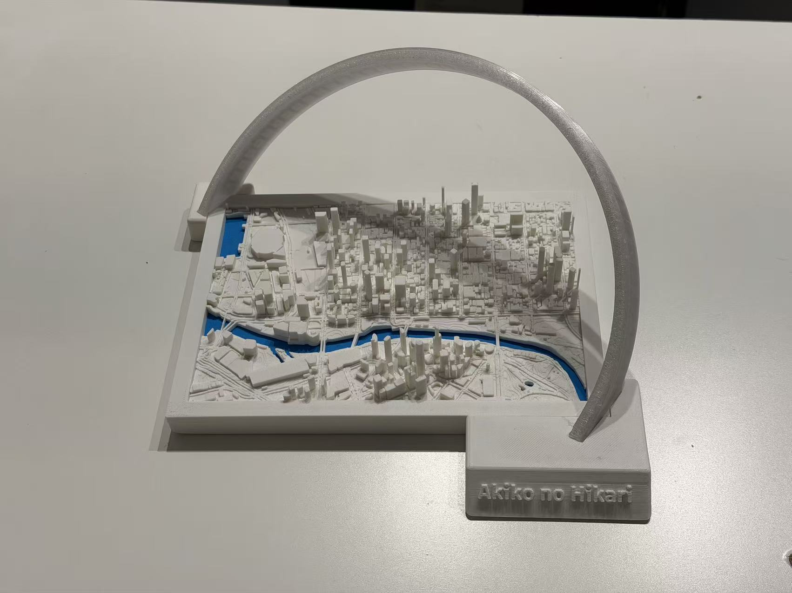
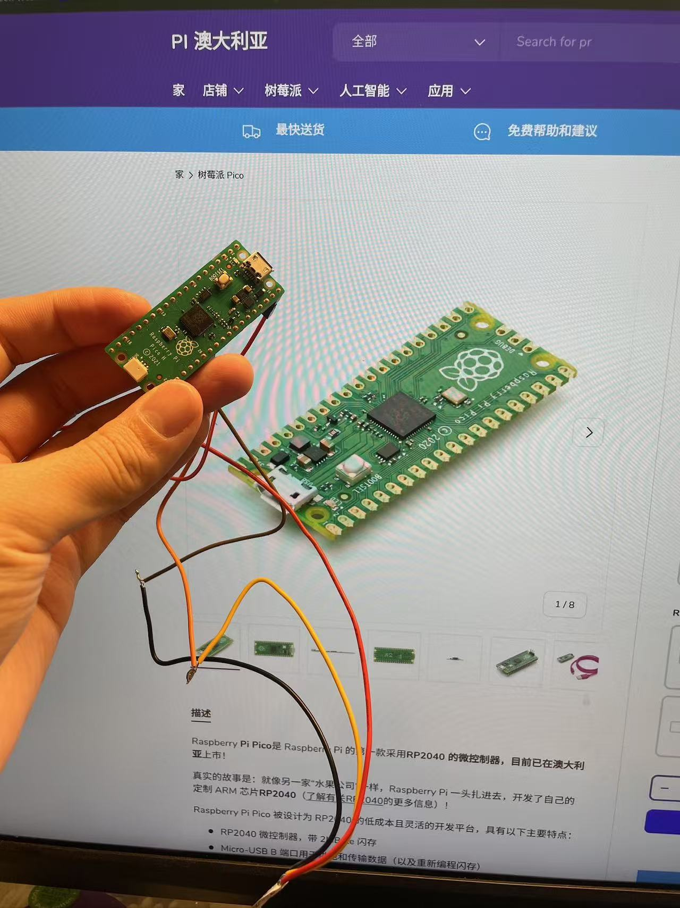
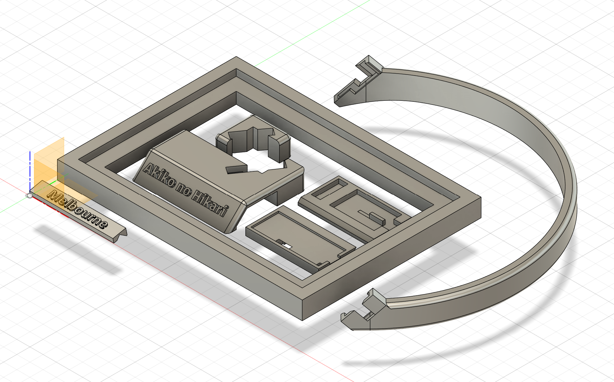
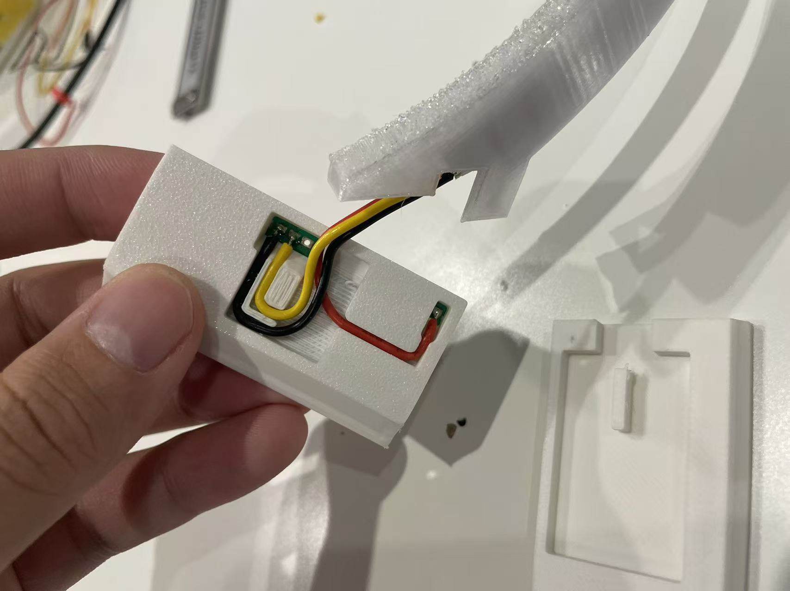
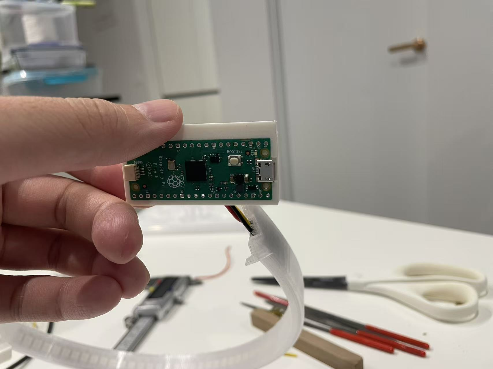
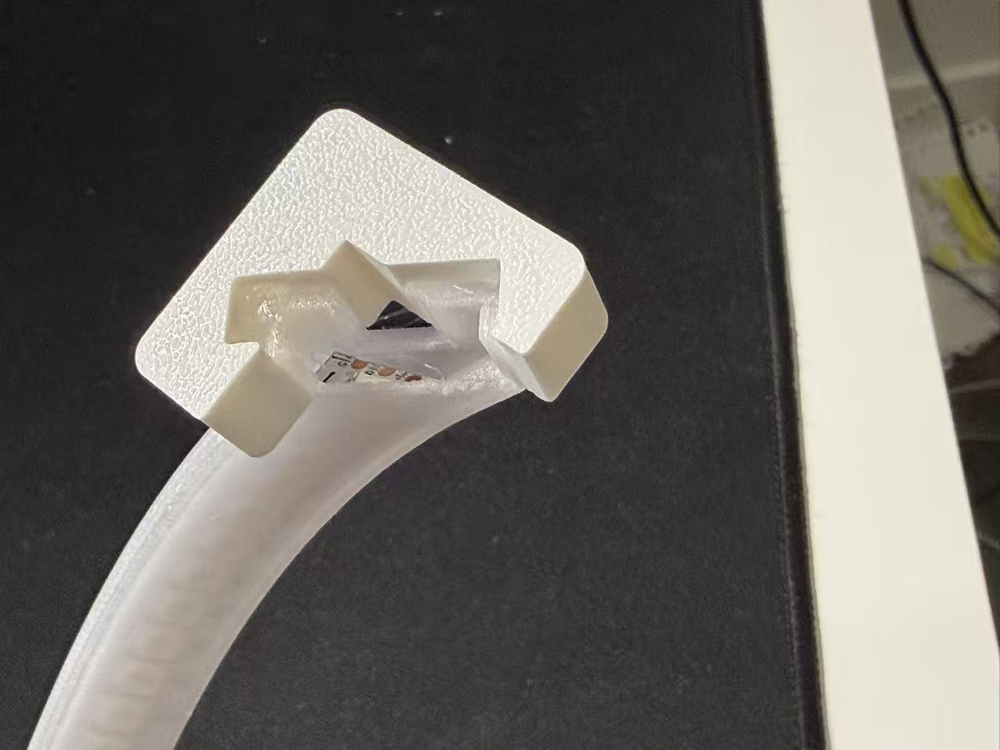
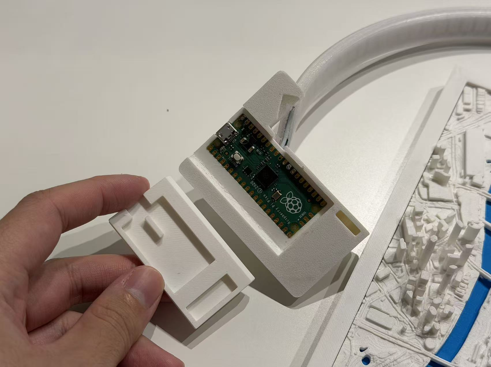
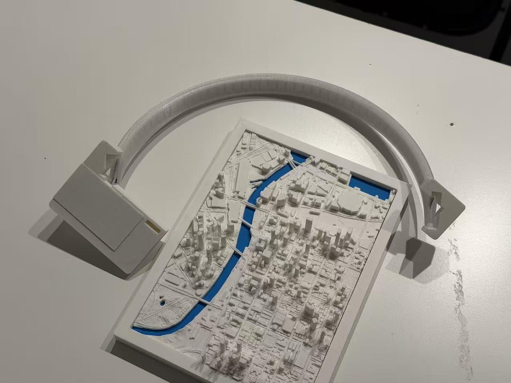
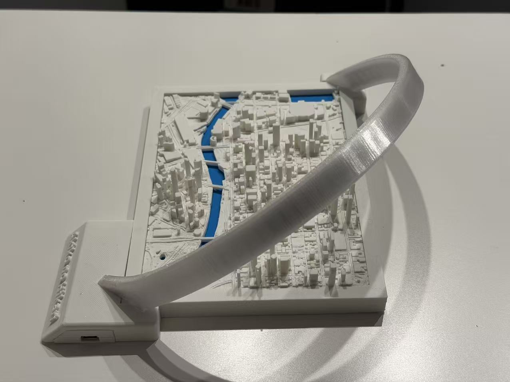

# Akiko-no-Hikari (晶子の光)
# Miniature Melbourne City Lighting Model

*Read this in other languages: [简体中文](README_CH.md), [Original Chinese Version](README_CH_Original.md)*

## Project Overview
This is a farewell gift for my friend to commemorate our life in Melbourne. It's a miniature Melbourne city model with added lighting effects that can simulate sunrise, sunset, and nighttime.

**Demo Video**: https://youtu.be/LcSbfyCi86A

This project involves multiple steps including 3D printing, electronic soldering, and microcontroller programming. In the following text, I will explain how to build this project.

## Materials List
- **3D Printer** (I used Bambu Lab A1)
- **3D Printing Materials**:
  - PLA_Matte (for the frame)
  - PETG_Transparent (for the light-transmitting LED track)
  - Bambu Lab official materials
- **Electronic Components**:
  - Raspberry Pi Pico RP2040 (stamp pad version)
  - WS2812 LED strip (48 LEDs, high-density version with 144 LEDs/meter)
- **Tools**:
  - Electronic soldering tools (solder, soldering iron, wires, etc.)
  - Strong adhesive (for bonding PLA_Matte and PETG_Transparent materials)

## Construction Process

The construction is divided into three main steps:
1. 3D Printing
2. Assembly and Soldering
3. Programming

### 1. 3D Printing
In the `3D_models` folder of the project directory, there are three files:
- `akiko_no_hikari_project.f3d`: Complete model (can be edited with Fusion 360)
- `frame.stl`: Frame and various components (to be printed with PLA_Matte material)
- `solar_track.stl`: Light-transmitting LED track (to be printed with PETG_Transparent material)

If you need to edit the model yourself, you can download akiko_no_hikari_project.f3d and open it with Fusion 360.

If you just want to print and assemble the model, you can directly download frame.stl and solar_track.stl for printing.

frame.stl should be printed with PLA Matte material, and solar_track.stl should be printed with PETG Transparent material.

**Printing Notes**:
- When printing `solar_track.stl`, adjust the support options:
  - Only use tree supports
  - Supports should only grow from the bottom up (no supports inside the model)
  - Pay attention to print speed and temperature control

### 2. Assembly and Soldering
1. **Connecting the Raspberry Pi Pico**:
   - Solder three wires to the stamp pads:
     - 5V power wire
     - GND ground wire
     - Data wire (Pin 22)
   - Refer to the reserved positions in the 3D printed PI bracket for the 5V and GND pad locations
   - Pay attention to the direction of the cables, as the Raspberry Pi Pico will eventually be placed in a custom bracket, so the wire direction should align with the cable slots in the bracket
   
   

2. **LED Strip Installation**:
   - Insert the LED strip into the light track
   - Assemble the Pi bracket, right support shell, and light track, and measure the approximate positions where the three wires will reach the LED strip pads
   - Cut the wires (too short or too long will cause problems), then solder the wires to the LED strip
   - If inconvenient, you can pull out the LED strip, solder it, and then put it back into the light track. The reason we put the LED strip in first is to measure the length of the wires
   - Solder the three trimmed wires to the LED strip
   
   

3. **Component Assembly**:
   - Combine the light track, left bracket, right bracket (support shell), and PI bracket, and secure them firmly with strong adhesive
   - Snap on the bottom panel of the Pi bracket (no glue needed, as this allows us to press the reset button on the development board later)

   
   
   

### 3. Programming
1. Follow online steps to install MicroPython on the Pi
2. Transfer the `code/main.py` file to the Pi
3. Power on and test

## Technical Specifications
- **Controller**: Raspberry Pi Pico (RP2040)
- **LED Type**: WS2812 programmable RGB LED
- **LED Count**: 48 units
- **Data Pin**: GPIO 22
- **Communication**: PIO (Programmable Input/Output) state machine
- **Clock Frequency**: 8MHz

## Features
- Uses Gaussian functions to simulate natural light distribution
- Controls light position and diffusion range by adjusting Gaussian parameters
- Dynamically adjusts RGB color values to simulate different times of day and color temperature changes

## Notes
The assembly and soldering parts may have some challenges. Choosing slightly thinner wires makes assembly easier.

## Contact
I hope you enjoy this model. If you have any questions, please submit an issue or contact me via email.
